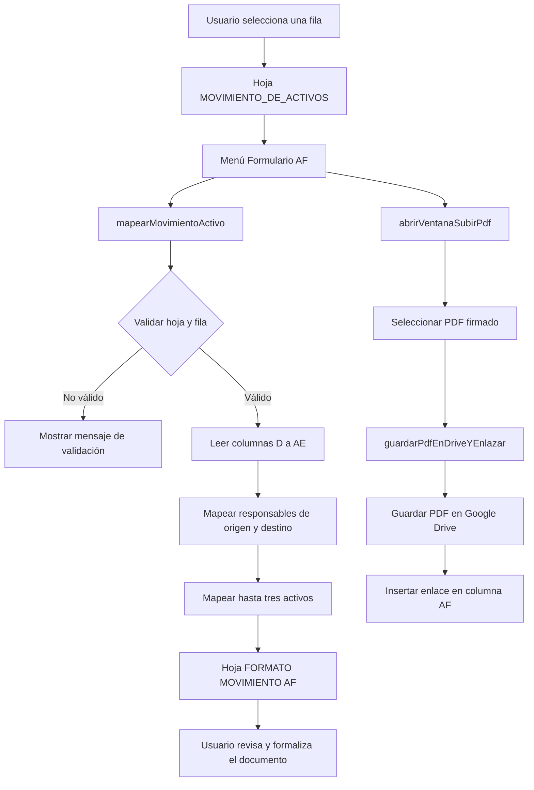

# Google Sheets Active Assets Mapping Tool

Automatización de procesos de gestión de activos tecnológicos desarrollada con Google Apps Script y Google Sheets.

Esta herramienta permite seleccionar una fila de movimientos de activos en la hoja `MOVIMIENTO_DE_ACTIVOS` y transferir sus datos, con un solo clic, a la plantilla oficial `FORMATO MOVIMIENTO AF`. El sistema reduce la digitación manual, estandariza la generación de formatos y mejora la trazabilidad documental del proceso de entrega y movimiento de equipos.

## Badges


## Características principales

- Mapeo de registros desde `MOVIMIENTO_DE_ACTIVOS` hacia `FORMATO MOVIMIENTO AF`.
- Transferencia de información de responsables de origen y destino.
- Soporte para hasta tres activos por movimiento.
- Asignación automática de datos a las celdas definidas en la plantilla institucional.
- Menú personalizado `Formulario AF` dentro de Google Sheets.
- Carga de PDF firmados desde una ventana modal HTML.
- Almacenamiento de documentos en Google Drive.
- Inserción automática de enlaces de archivos PDF en la columna `AF`.
- Validación de hoja activa y fila seleccionada antes de ejecutar operaciones.
- Arquitectura modular para separar configuración, enrutamiento, soporte, activos, información técnica y utilidades.
- Uso de `const` y `let` para mejorar la legibilidad y reducir errores por reasignación accidental.
- Comentarios JSDoc y documentación técnica orientada al mantenimiento del sistema.

## Problema que resuelve

Los movimientos de activos tecnológicos suelen requerir copiar manualmente información entre hojas de cálculo y formatos oficiales. Este proceso puede generar errores de digitación, pérdida de tiempo y formatos incompletos.

La solución automatiza la transferencia de información mediante una acción controlada desde el libro de Google Sheets. El usuario selecciona una fila, ejecuta la opción correspondiente y el sistema completa la plantilla de entrega con los datos del movimiento y de los activos asociados.

## Flujo de trabajo



### Secuencia resumida

1. El usuario abre el libro de Google Sheets.
2. Selecciona cualquier celda de una fila válida en `MOVIMIENTO_DE_ACTIVOS`.
3. Abre el menú `Formulario AF`.
4. Ejecuta `Mapear Fila Seleccionada`.
5. El sistema lee 28 columnas desde `D` hasta `AE`.
6. Los datos de colaboradores se copian a las secciones de origen y destino.
7. Los datos de hasta tres activos se copian a las filas 20, 21 y 22.
8. La hoja `FORMATO MOVIMIENTO AF` queda activa para revisión.
9. Opcionalmente, el usuario selecciona `Adjuntar PDF Firmado`.
10. El PDF se guarda en Drive y su enlace queda registrado en la columna `AF`.

## Estructura del proyecto

```text
codigo_sistemas/
|
|-- Config.js
|-- GestionActivos.js
|-- Router.js
|-- SoporteMantenimiento.js
|-- TecnicaEquipos.js
|-- Utils.js
|-- Index.html
|-- SubirArchivoHTML.html
|-- README.md
```

### `Config.js`

Centraliza la configuración del proyecto, incluyendo:

- Identificadores de hojas y carpetas.
- Acceso a `ScriptProperties`.
- Apertura de Spreadsheet y carpetas de Drive.
- Nombres configurables de hojas de mantenimiento, respuestas, activos y formato.

### `GestionActivos.js`

Contiene la funcionalidad específica de movimientos de activos:

- `onOpen()` crea el menú personalizado.
- `mapearMovimientoActivo()` copia la información de la fila seleccionada.
- `abrirVentanaSubirPdf()` abre el diálogo de carga.
- `guardarPdfEnDriveYEnlazar()` guarda el PDF y crea el vínculo en la hoja.

Para el flujo vinculado al libro de activos, este módulo utiliza el Spreadsheet activo y las hojas:

- `MOVIMIENTO_DE_ACTIVOS`
- `FORMATO MOVIMIENTO AF`

### `Router.js`

Centraliza los puntos de entrada del Web App:

- `doGet(e)` sirve el formulario o documentos HTML autorizados.
- `doPost(e)` procesa cargas de archivos y registros técnicos.
- Valida el token de la API cuando corresponde.

### `SoporteMantenimiento.js`

Gestiona el formulario de soporte y mantenimiento:

- Validación y normalización de datos.
- Generación consecutiva de identificadores de solicitud.
- Uso de `LockService` para evitar colisiones.
- Creación de carpetas de evidencia.
- Almacenamiento de fotografías.
- Generación de evidencias HTML.
- Sincronización de evidencias con `MANTENIMIENTOS`.

### `TecnicaEquipos.js`

Gestiona la información técnica de los equipos:

- Creación y actualización de registros en `TECNICA_EQUIPOS`.
- Detección por `ID_EQUIPO` o `SERIAL_BIOS`.
- Prevención de registros duplicados.
- Procesamiento de respuestas de formularios.
- Registro de incidencias y depuración histórica.

### `Utils.js`

Incluye funciones reutilizables para:

- Respuestas JSON.
- Normalización de encabezados.
- Limpieza de nombres de carpetas.
- Sanitización de texto.
- Protección contra interpretación de fórmulas en Sheets.
- Escape de contenido HTML.
- Validación básica de identificadores de Drive.

### `Index.html`

Interfaz web del formulario de soporte y mantenimiento, con validaciones de cliente, carga de fotografías y comunicación con Apps Script mediante `google.script.run`.

### `SubirArchivoHTML.html`

Ventana modal para seleccionar y enviar PDF firmados desde Google Sheets.

## Guía de instalación y configuración

### Requisitos

- Cuenta de Google con acceso a Google Sheets, Drive y Apps Script.
- Libro de Google Sheets donde se ejecutará el proyecto.
- Permisos de edición sobre las hojas y carpetas de Drive utilizadas.
- Navegador actualizado.

### Instalación en Google Sheets

1. Abra el libro de Google Sheets que utilizará como base.
2. Verifique que existan las hojas:
   - `MOVIMIENTO_DE_ACTIVOS`
   - `FORMATO MOVIMIENTO AF`
3. Abra **Extensiones > Apps Script**.
4. Cree o reemplace los archivos `.js` del proyecto:
   - `Config.js`
   - `GestionActivos.js`
   - `Router.js`
   - `SoporteMantenimiento.js`
   - `TecnicaEquipos.js`
   - `Utils.js`
5. Cree los archivos HTML:
   - `Index.html`
   - `SubirArchivoHTML.html`
6. Pegue el contenido correspondiente en cada archivo.
7. Guarde el proyecto.
8. Regrese al libro de Google Sheets y recargue la página.
9. Ejecute `onOpen()` manualmente desde el editor de Apps Script la primera vez.
10. Acepte los permisos solicitados por Google.
11. Recargue nuevamente el libro y confirme que aparece el menú `Formulario AF`.

### Configuración de propiedades

En **Apps Script > Configuración del proyecto > Propiedades de secuencia de comandos**, configure las propiedades que correspondan a los módulos utilizados:

| Propiedad | Uso |
|---|---|
| `SPREADSHEET_ID` | Opcional. Solo se requiere para módulos que deban abrir un libro externo; el módulo de activos usa el libro actual mediante `SpreadsheetApp.getActiveSpreadsheet()` |
| `APP_TOKEN` | Autenticación del endpoint `doPost(e)` |
| `DRIVE_FOLDER_ID` | Carpeta autorizada para archivos HTML publicados |
| `EVIDENCE_ROOT_FOLDER_ID` | Carpeta raíz de evidencias |
| `EVIDENCE_HTML_FOLDER_ID` | Carpeta de evidencias HTML |
| `PDF_FOLDER_ID` | Carpeta de PDF de activos |
| `MAINTENANCE_SHEET_NAME` | Nombre alternativo de la hoja de mantenimiento |
| `TECHNICAL_SHEET_NAME` | Nombre alternativo de la hoja técnica |
| `FORM_RESPONSES_SHEET` | Hoja de respuestas de formulario |

El módulo de movimientos de activos vinculado al libro utiliza directamente el Spreadsheet activo y las hojas `MOVIMIENTO_DE_ACTIVOS` y `FORMATO MOVIMIENTO AF`.

### Autorización

La primera ejecución puede solicitar permisos para:

- Leer y modificar hojas de cálculo.
- Crear y leer archivos de Google Drive.
- Ejecutar servicios de Apps Script.
- Crear triggers instalables, si se utiliza el módulo técnico.

Conceda permisos únicamente a usuarios y cuentas que deban administrar el proceso.

## Ejemplo de uso

### Mapear un movimiento de activos

1. Abra la hoja `MOVIMIENTO_DE_ACTIVOS`.
2. Seleccione una celda de la fila que desea procesar.
3. Abra el menú `Formulario AF`.
4. Seleccione `1. Mapear Fila Seleccionada`.
5. Revise la hoja `FORMATO MOVIMIENTO AF`.
6. Compruebe los responsables y los datos de los activos en las filas 20 a 22.

### Adjuntar un PDF firmado

1. Permanezca en la hoja `MOVIMIENTO_DE_ACTIVOS`.
2. Seleccione la fila correspondiente.
3. Abra `Formulario AF > 2. Adjuntar PDF Firmado`.
4. Seleccione un archivo PDF.
5. Pulse `Subir y Guardar Enlace`.
6. Verifique el vínculo `Ver PDF Firmado` en la columna `AF`.

### Ejemplo de ejecución directa

Las funciones públicas también pueden asignarse a botones o dibujos de Google Sheets:

```text
mapearMovimientoActivo
abrirVentanaSubirPdf
```

No agregue paréntesis al asignar la función.

## Buenas prácticas operativas

- Mantener los nombres de las hojas exactamente como están definidos.
- Evitar cambiar la estructura de columnas de `MOVIMIENTO_DE_ACTIVOS` sin actualizar el mapeo.
- Verificar que la fila seleccionada no sea la fila de encabezados.
- Revisar permisos de Drive antes de habilitar enlaces compartidos.
- Mantener actualizado el despliegue del Web App después de modificar `Router.js`.
- Probar el flujo en una copia del libro antes de aplicarlo al entorno operativo.
- Mantener respaldos periódicos de las hojas y carpetas de evidencias.

## Licencia

Este proyecto se propone para distribución bajo la licencia MIT. Antes de publicar el repositorio, agregue un archivo `LICENSE` con el texto oficial de dicha licencia para formalizar los términos de uso, modificación y distribución.

## Créditos de desarrollo

Desarrollado para automatizar procesos de administración de activos tecnológicos, control documental y soporte operativo mediante Google Sheets, Google Drive y Google Apps Script.

El proyecto demuestra competencias en:

- Desarrollo JavaScript en Google Apps Script.
- Automatización de procesos administrativos y de TI.
- Integración entre Google Sheets y Google Drive.
- Diseño de flujos de datos orientados a operaciones.
- Validación y normalización de información.
- Control de concurrencia con `LockService`.
- Organización modular y mantenimiento de código.
